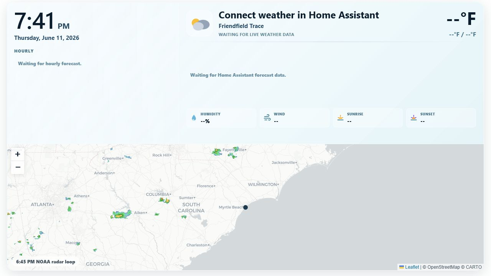

Weather Wise is a polished Home Assistant dashboard card for current conditions, forecasts, and NOAA radar.



Use it with any Home Assistant `weather` entity:

```yaml
type: custom:weather-wise-card
entity: weather.home
name: Home
latitude: 33.688
longitude: -78.886
```
